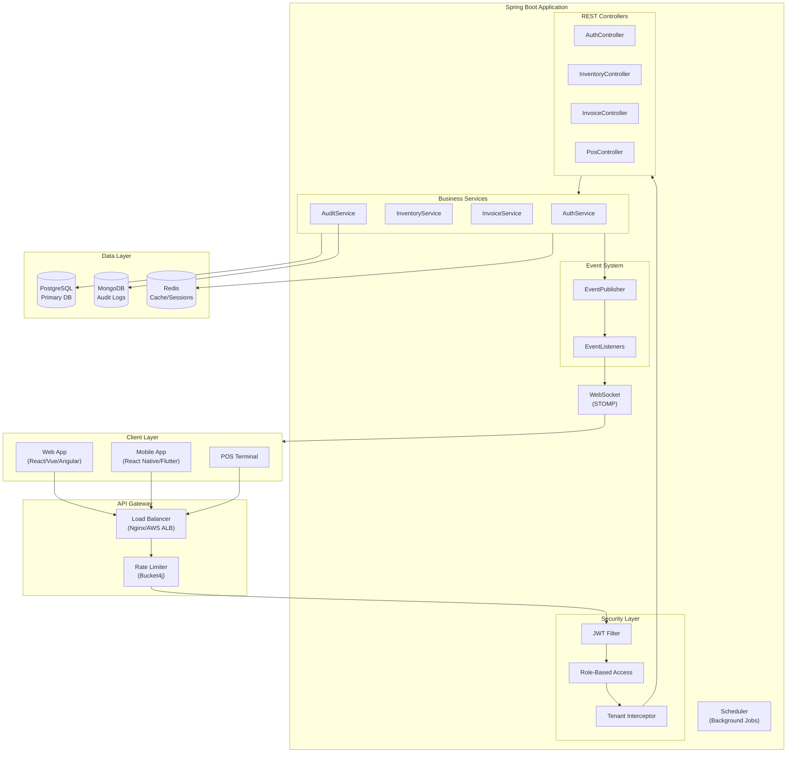
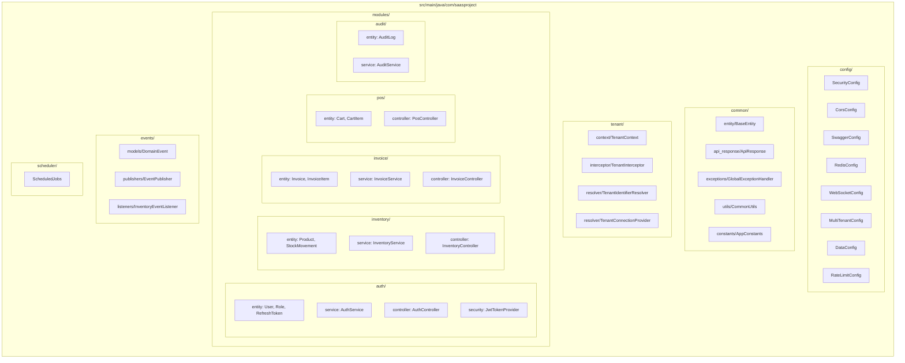
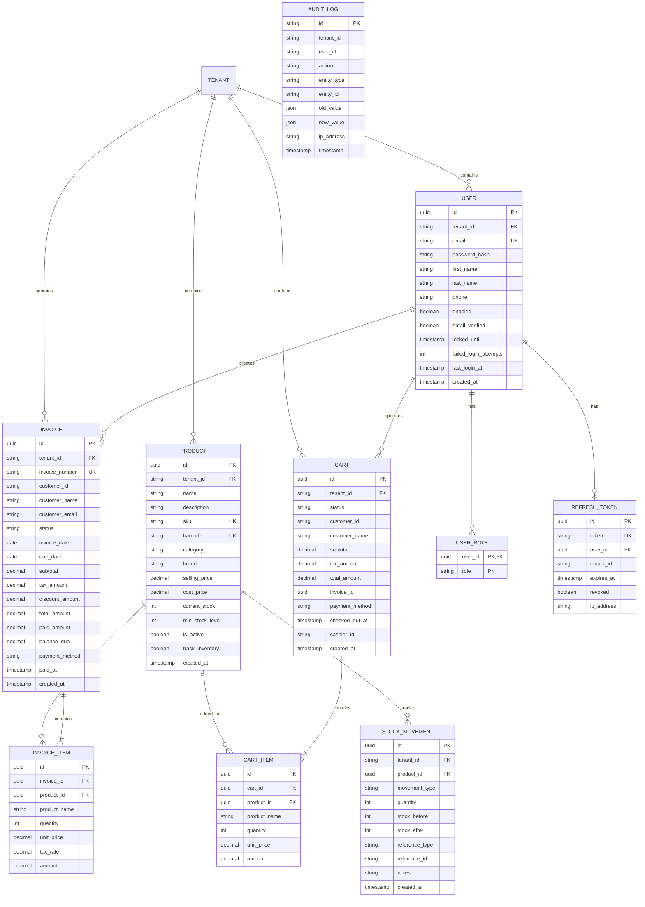
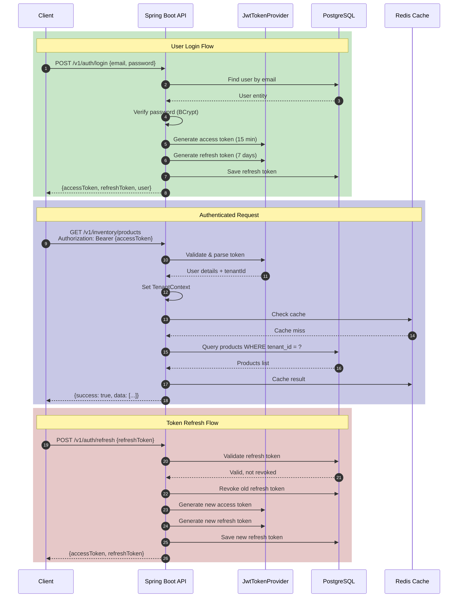
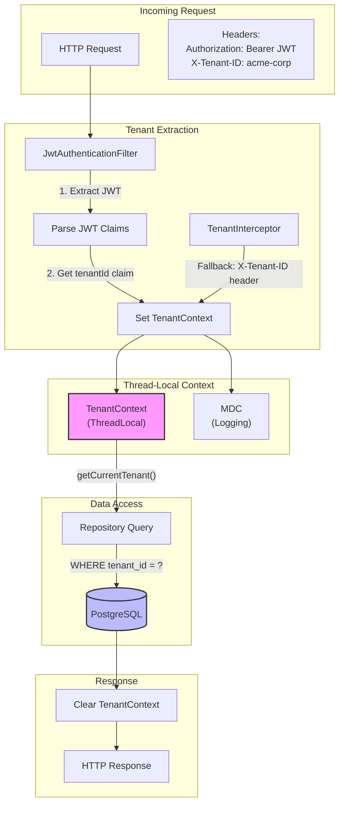
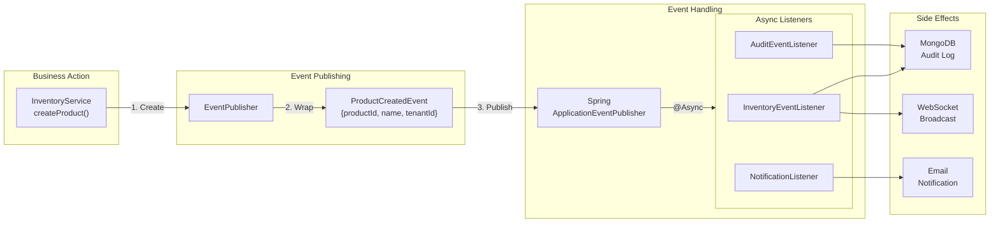
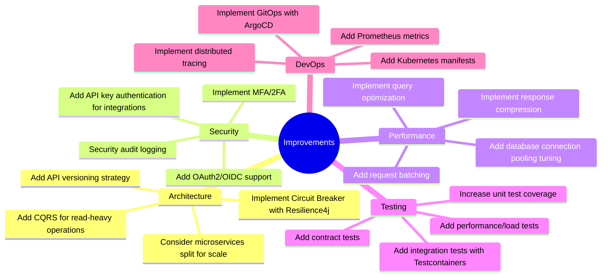

# Project Documentation

Comprehensive documentation for the SaaS Inventory + Billing + POS backend template.

---

## Table of Contents

1. [Architecture Overview](#architecture-overview)
2. [Project Structure](#project-structure)
3. [Entity Relationship Diagram](#entity-relationship-diagram)
4. [Authentication Flow](#authentication-flow)
5. [Multi-Tenant Architecture](#multi-tenant-architecture)
6. [API Endpoints](#api-endpoints)
7. [Event System](#event-system)
8. [What's Remaining](#whats-remaining)
9. [Improvement Suggestions](#improvement-suggestions)

---

## Architecture Overview



---

## Project Structure



---

## Entity Relationship Diagram



---

## Authentication Flow



---

## Multi-Tenant Architecture



---

## API Endpoints

### Authentication (`/v1/auth`)
| Method | Endpoint | Description | Auth Required |
|--------|----------|-------------|---------------|
| POST | `/register` | Register new user | ❌ |
| POST | `/login` | Login, returns JWT | ❌ |
| POST | `/refresh` | Refresh access token | ❌ |
| POST | `/logout` | Revoke all tokens | ✅ |
| POST | `/forgot-password` | Request password reset | ❌ |
| POST | `/reset-password` | Reset with token | ❌ |
| POST | `/change-password` | Change password | ✅ |
| GET | `/me` | Get current user | ✅ |

### Inventory (`/v1/inventory`)
| Method | Endpoint | Description | Roles |
|--------|----------|-------------|-------|
| POST | `/products` | Create product | ADMIN, MANAGER |
| GET | `/products` | List products | ALL |
| GET | `/products/{id}` | Get product | ALL |
| PUT | `/products/{id}` | Update product | ADMIN, MANAGER |
| DELETE | `/products/{id}` | Delete product | ADMIN, MANAGER |
| PUT | `/products/{id}/stock` | Update stock | ADMIN, MANAGER |
| GET | `/products/low-stock` | Low stock alerts | ADMIN, MANAGER |
| GET | `/products/barcode/{code}` | Lookup by barcode | ALL |
| GET | `/products/search` | Search products | ALL |

### Invoices (`/v1/invoices`)
| Method | Endpoint | Description | Roles |
|--------|----------|-------------|-------|
| POST | `/` | Create invoice | ADMIN, MANAGER, CASHIER |
| GET | `/` | List invoices | ALL |
| GET | `/{id}` | Get invoice | ALL |
| POST | `/{id}/payments` | Record payment | ADMIN, MANAGER, CASHIER |
| POST | `/{id}/cancel` | Cancel invoice | ADMIN, MANAGER |
| GET | `/{id}/pdf` | Export as PDF | ALL |

### POS (`/v1/pos`)
| Method | Endpoint | Description | Roles |
|--------|----------|-------------|-------|
| POST | `/cart` | Create cart | ADMIN, MANAGER, CASHIER |
| GET | `/cart/{id}` | Get cart | ALL |
| POST | `/cart/{id}/items` | Add item | ADMIN, MANAGER, CASHIER |
| PUT | `/cart/{id}/items/{productId}` | Update quantity | ADMIN, MANAGER, CASHIER |
| DELETE | `/cart/{id}/items/{productId}` | Remove item | ADMIN, MANAGER, CASHIER |
| POST | `/cart/{id}/checkout` | Checkout | ADMIN, MANAGER, CASHIER |

---

## Event System



---

## What's Remaining

### 🔴 Not Implemented
| Module | Status |
|--------|--------|
| **Subscription Billing** | Payment gateway facade ready, needs billing cycle logic |
| **Printer Support** | Print job queue, receipt templates, ESC/POS commands |
| **Multi-location** | Support for multiple stores/warehouses |
| **Import/Export** | CSV/Excel import/export for products |

### ✅ Recently Implemented
| Module | Features |
|--------|----------|
| **Company/Tenant** | Entity, settings, subscription tier |
| **Supplier** | Full CRUD, search, financial details |
| **Customer** | Full CRUD, loyalty points, phone lookup |
| **Purchase Orders** | Full workflow: create, approve, send, receive, cancel |
| **User Management** | Admin CRUD, role assignment, enable/disable |
| **Reports/Dashboard** | Sales metrics, inventory metrics, analytics |
| **Email Service** | Templates for welcome, password reset, invoices, alerts |
| **Payment Gateway** | Razorpay/Stripe facade (mock mode available) |
| **Notifications** | Real-time WebSocket notifications |
| **POS** | Complete service: cart, checkout, barcode scan |

---

## Improvement Suggestions

### 🏗️ Architecture Improvements



### 📝 Specific Code Improvements

| Area | Current | Suggested Improvement |
|------|---------|----------------------|
| **DTOs** | Manual mapping | Use MapStruct generated mappers consistently |
| **Validation** | Basic Bean Validation | Add custom validators, cross-field validation |
| **Caching** | Basic Redis caching | Add cache invalidation strategy, TTL tuning |
| **Logging** | Basic SLF4J | Add correlation IDs, structured logging fields |
| **Error Codes** | String-based | Use enum-based error codes with i18n |
| **Pagination** | Basic offset | Add cursor-based pagination for large datasets |
| **Search** | LIKE queries | Integrate Elasticsearch for full-text search |
| **File Storage** | Not implemented | Add S3/MinIO for product images |

### 🔒 Security Enhancements

1. **Add Security Headers Filter**
   - X-Content-Type-Options: nosniff
   - X-Frame-Options: DENY
   - Strict-Transport-Security

2. **Implement Audit Trail**
   - Log all data mutations
   - Track who changed what and when
   - Immutable audit log

3. **Add IP Whitelisting**
   - For admin endpoints
   - Configurable per tenant

4. **Implement Request Signing**
   - For webhook callbacks
   - HMAC signature verification

### 📦 Missing Dependencies to Add

```xml
<!-- Add to pom.xml -->

<!-- Email -->
<dependency>
    <groupId>org.springframework.boot</groupId>
    <artifactId>spring-boot-starter-mail</artifactId>
</dependency>

<!-- Excel Export -->
<dependency>
    <groupId>org.apache.poi</groupId>
    <artifactId>poi-ooxml</artifactId>
    <version>5.2.5</version>
</dependency>

<!-- Barcode Generation -->
<dependency>
    <groupId>com.google.zxing</groupId>
    <artifactId>core</artifactId>
    <version>3.5.3</version>
</dependency>

<!-- Circuit Breaker -->
<dependency>
    <groupId>io.github.resilience4j</groupId>
    <artifactId>resilience4j-spring-boot3</artifactId>
    <version>2.2.0</version>
</dependency>
```

---

## Deployment Checklist

- [ ] Change JWT secret to secure random value
- [ ] Configure production database credentials
- [ ] Set up SSL/TLS certificates
- [ ] Configure CORS for production domains
- [ ] Set up monitoring (Prometheus + Grafana)
- [ ] Configure log aggregation (ELK/Loki)
- [ ] Set up backup strategy for databases
- [ ] Configure rate limiting per environment
- [ ] Review and harden security settings
- [ ] Load test with expected traffic
